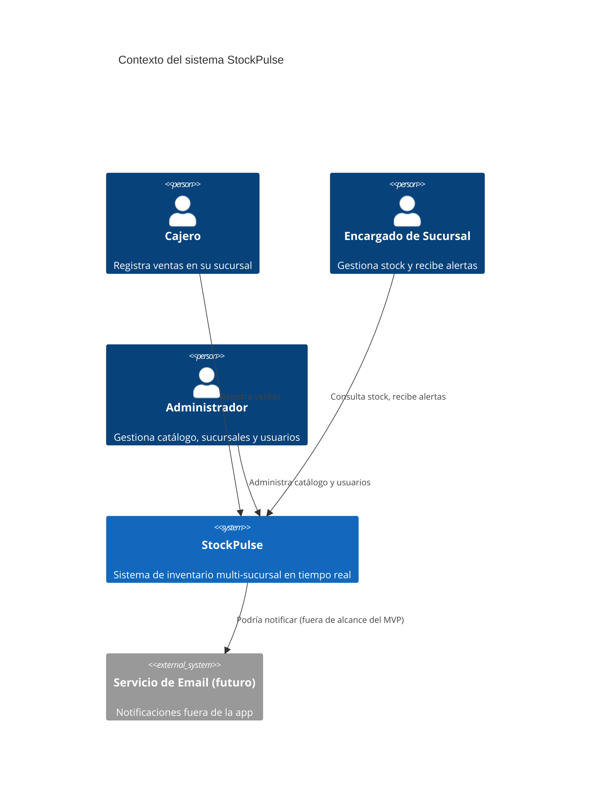
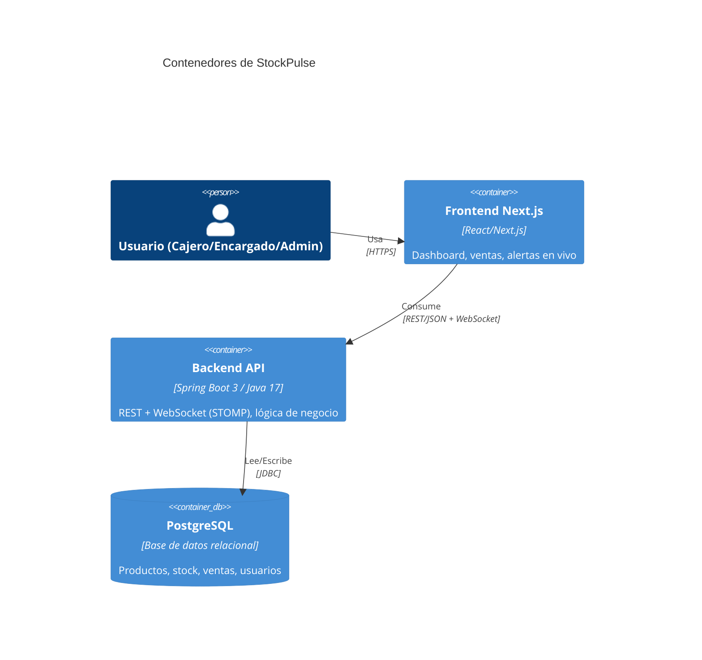
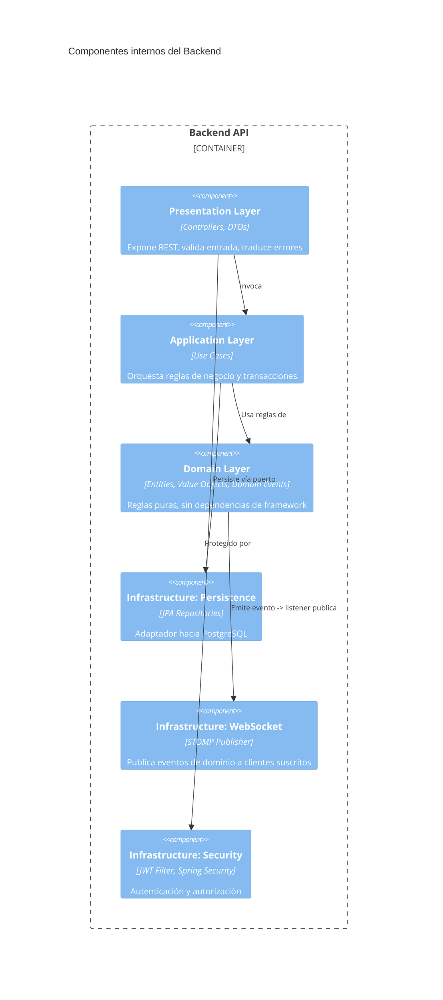
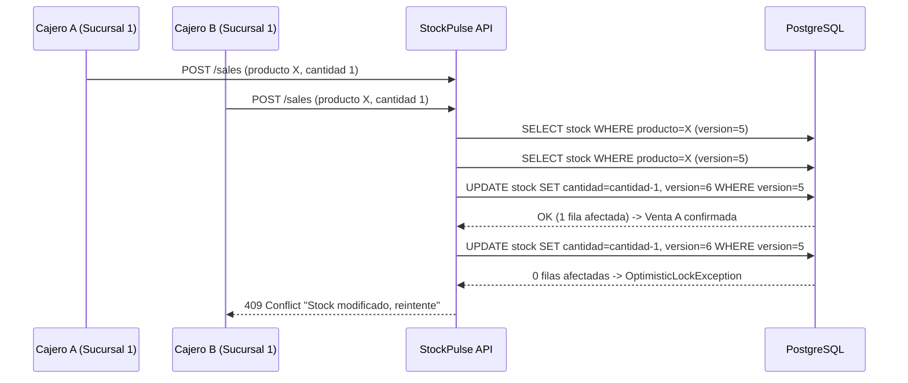
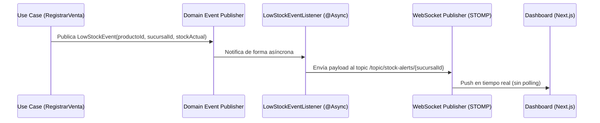
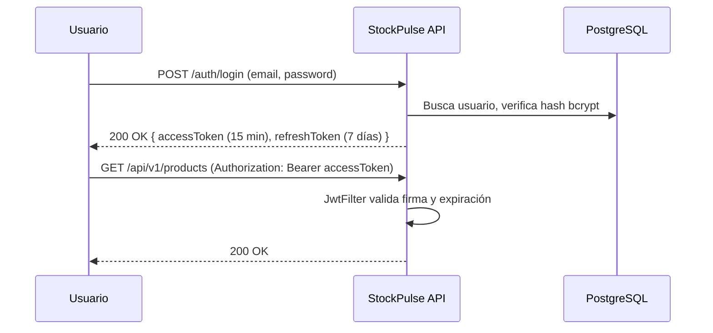

# Arquitectura — StockPulse

## 1. Contexto (C4 Nivel 1)

## 2. Contenedores (C4 Nivel 2)

## 3. Componentes del Backend (C4 Nivel 3) — Hexagonal / Clean Architecture

**Regla de dependencia (la que defiendes en entrevista):** las flechas de dependencia de código siempre apuntan HACIA el dominio. `domain/` no importa nada de `infrastructure/` ni de Spring. Si un test unitario del dominio necesita un mock de Spring, es una señal de que la capa está mal separada.

## 4. Flujo crítico 1 — Venta con control de concurrencia

## 5. Flujo crítico 2 — Alerta de bajo stock en tiempo real

## 6. Decisiones de arquitectura (ADR resumido)

| # | Decisión | Alternativas descartadas | Justificación |
|---|---|---|---|
| ADR-01 | Clean/Hexagonal Architecture | Arquitectura en capas tradicional (Controller-Service-Repository plano) | Permite testear reglas de negocio sin levantar contexto de Spring; aísla el dominio de cambios de framework |
| ADR-02 | Locking optimista (`@Version`) | Locking pesimista (`SELECT FOR UPDATE`) | El conflicto es poco frecuente; pesimista introduce contención innecesaria en el camino feliz |
| ADR-03 | Domain Events + listener asíncrono para alertas | Llamar directo al WebSocket desde el use case | Desacopla "vender" de "notificar"; se puede agregar un canal nuevo (ej. email) sin tocar el caso de uso |
| ADR-04 | JWT stateless (sin sesión de servidor) | Sesiones con Redis | Permite escalar horizontalmente sin sticky sessions; más simple para un MVP de portafolio |
| ADR-05 | Flyway para migraciones | Hibernate `ddl-auto=update` | Esquema versionado y reproducible en CI; `ddl-auto` es inaceptable en un sistema con datos reales |

## 7. Seguridad — flujo de autenticación

## 8. Referencias cruzadas

- Modelo de entidades detallado: `docs/entities.md` (o sección de entidades del documento de setup previo)
- Requerimientos funcionales: `docs/requirements-functional.md`
- Requerimientos no funcionales: `docs/requirements-non-functional.md`
- Historias de usuario: `docs/user-stories.md`