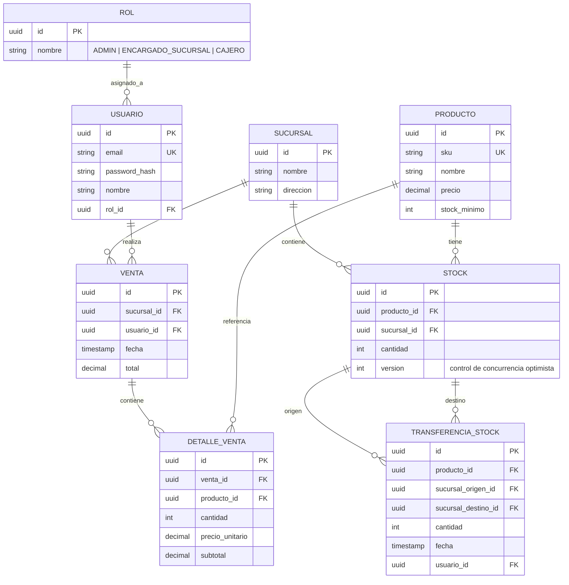

# Modelo de Entidades — StockPulse

Este documento especifica el modelo de datos y las entidades de dominio para **StockPulse**.

## Diagrama Entidad-Relación (ER)

## Definición de Entidades

### 1. Producto
Representa un artículo en el catálogo global.
- `id`: UUID (PK)
- `sku`: String (Único, no nulo)
- `nombre`: String (no nulo)
- `precio`: BigDecimal (no nulo, >= 0)
- `stock_minimo`: int (no nulo, >= 0, umbral para alertas)

### 2. Sucursal
Representa una sede física del negocio.
- `id`: UUID (PK)
- `nombre`: String (no nulo)
- `direccion`: String

### 3. Stock
Mantiene las existencias de un producto en una sucursal específica con control de concurrencia optimista.
- `id`: UUID (PK)
- `producto_id`: UUID (FK -> Producto)
- `sucursal_id`: UUID (FK -> Sucursal)
- `cantidad`: int (no nulo, >= 0 — RN-01)
- `version`: Long (`@Version` para locking optimista)

### 4. Venta
Registro de una transacción comercial en una sucursal.
- `id`: UUID (PK)
- `sucursal_id`: UUID (FK -> Sucursal)
- `usuario_id`: UUID (FK -> Usuario - Cajero)
- `fecha`: LocalDateTime (Timestamp)
- `total`: BigDecimal (>= 0)

### 5. DetalleVenta
Línea individual dentro de una venta.
- `id`: UUID (PK)
- `venta_id`: UUID (FK -> Venta)
- `producto_id`: UUID (FK -> Producto)
- `cantidad`: int (> 0)
- `precio_unitario`: BigDecimal (>= 0)
- `subtotal`: BigDecimal (`cantidad * precio_unitario`)

### 6. TransferenciaStock
Registro atómico del movimiento de inventario entre dos sucursales.
- `id`: UUID (PK)
- `producto_id`: UUID (FK -> Producto)
- `sucursal_origen_id`: UUID (FK -> Sucursal)
- `sucursal_destino_id`: UUID (FK -> Sucursal)
- `cantidad`: int (> 0)
- `fecha`: LocalDateTime
- `usuario_id`: UUID (FK -> Usuario - Encargado/Admin)

### 7. Usuario
Usuario autenticado y operador del sistema.
- `id`: UUID (PK)
- `email`: String (Único, no nulo)
- `password_hash`: String (BCrypt)
- `nombre`: String (no nulo)
- `rol_id`: UUID (FK -> Rol)
- **Persistencia**: Mapeado por `UsuarioJpaEntity` y gestionado mediante `SpringDataUsuarioRepository`.
- **Endpoint Explicito**: Expuesto en `GET /api/v1/users` para selección dinámica de operadores en transferencias.
- **Seeder**: Precargado mediante migraciones Flyway `V2__seed_data.sql` y `V3__additional_users_seed.sql`.

### 8. Rol
Rol de acceso en el sistema.
- `id`: UUID (PK)
- `nombre`: String (`ADMIN`, `ENCARGADO_SUCURSAL`, `CAJERO`)

